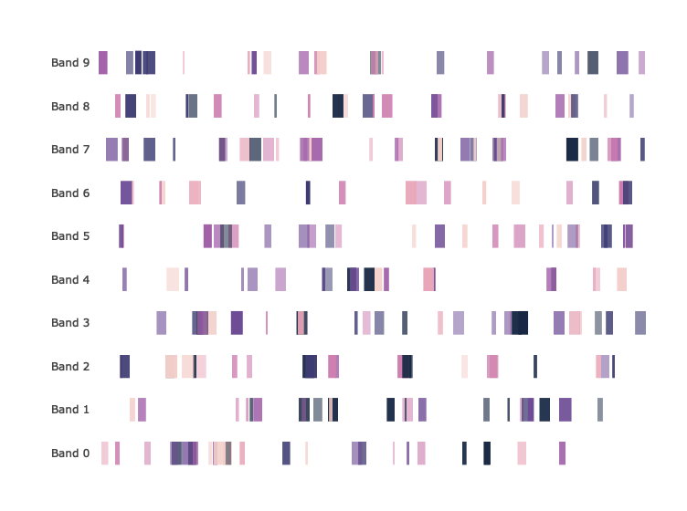

<!-- README.md is generated from README.Rmd. Please edit that file -->

# bands

Simple interactive chromosome maps written in R

## Source

``` r
source("bands.R")
```

## Example Data

``` r
samples <- 250
bands <- paste('Band', 0:9)
starts <- sample(1:500000, samples, replace=TRUE)
ends <- sapply(starts, function(x) x+sample(1:10000, 1))
names <- paste('Label', sample(LETTERS, samples, replace=TRUE))
colors <- sample(c('#f3cec9', '#e7a4b6', '#cd7eaf', '#a262a9', '#6f4d96', '#3d3b72', '#182844'), samples, replace=T)
opacitys <- sample(50:100/100, samples, replace=TRUE)

df <- data.frame(band = sample(bands, samples, replace=TRUE),
                 start = starts,
                 end = ends,
                 name = names,
                 color = colors,
                 opacity = opacitys,
                 stringsAsFactors=FALSE)

dim(df)
```

    [1] 250   6

``` r
head(df)
```

``` 
    band  start    end    name   color opacity
1 Band 1 122048 127772 Label P #f3cec9    0.72
2 Band 4 223957 227019 Label T #6f4d96    0.50
3 Band 7 449479 457139 Label P #f3cec9    0.86
4 Band 1  23541  32402 Label R #e7a4b6    0.54
5 Band 1 151790 156655 Label K #f3cec9    0.83
6 Band 2 235561 235929 Label G #a262a9    0.91
```

## Plot Bands

``` r
draw.bands(df)
```

<!-- -->

## Real Data Interactive Examples

Please visit <https://anfederico.github.io/bands/>
