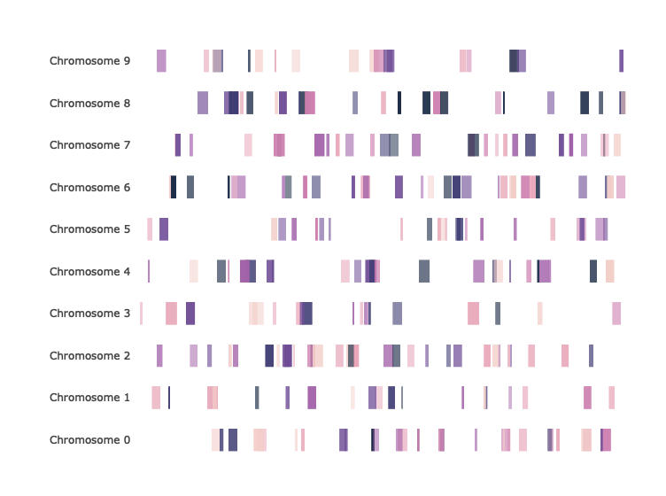
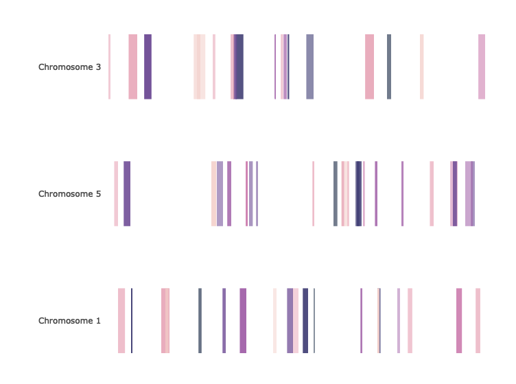

<!-- README.md is generated from README.Rmd. Please edit that file -->

# bands

Simple interactive chromosome maps written in R

## Source

``` r
library(bands)
```

## Barebones Example Data

``` r
samples <- 250
bands <- paste('Chromosome', 0:9)
starts <- sample(1:500000, samples, replace=TRUE)
ends <- sapply(starts, function(x) x+sample(1:10000, 1))

df <- data.frame(band = sample(bands, samples, replace=TRUE),
                 start = starts,
                 end = ends,
                 stringsAsFactors=FALSE)

dim(df)
```

    [1] 250   3

``` r
head(df)
```

``` 
          band  start    end
1 Chromosome 2 311872 317758
2 Chromosome 9  57524  61081
3 Chromosome 0 191142 199322
4 Chromosome 0 354011 354737
5 Chromosome 7 336282 336884
6 Chromosome 6 372630 374932
```

### Deafult Plot

``` r
draw.bands(df)
```

<!-- -->

## Detailed Example Data

``` r
samples <- 250
bands <- paste('Chromosome', 0:9)
starts <- sample(1:500000, samples, replace=TRUE)
ends <- sapply(starts, function(x) x+sample(1:10000, 1))
names <- paste('Label', sample(LETTERS, samples, replace=TRUE))
colors <- sample(c('#f3cec9', '#e7a4b6', '#cd7eaf', '#a262a9', '#6f4d96', '#3d3b72', '#182844'), samples, replace=T)
opacitys <- sample(50:100/100, samples, replace=TRUE)

df <- data.frame(band = sample(bands, samples, replace=TRUE),
                 start = starts,
                 end = ends,
                 name = names,
                 color = colors,
                 opacity = opacitys,
                 stringsAsFactors=FALSE)

dim(df)
```

    [1] 250   6

``` r
head(df)
```

``` 
          band  start    end    name   color opacity
1 Chromosome 7 342089 346849 Label T #cd7eaf    0.81
2 Chromosome 5 388643 390017 Label F #a262a9    0.79
3 Chromosome 3 166095 166925 Label G #e7a4b6    0.68
4 Chromosome 7 481014 481665 Label Y #182844    0.72
5 Chromosome 1 244832 251148 Label D #e7a4b6    0.51
6 Chromosome 3 369521 373612 Label R #182844    0.62
```

### Default Plot

``` r
draw.bands(df)
```

<!-- -->

### Limit or Reorder Bands

``` r
draw.bands(df, bands=c("Chromosome 1", "Chromosome 5", "Chromosome 3"))
```

<!-- -->
